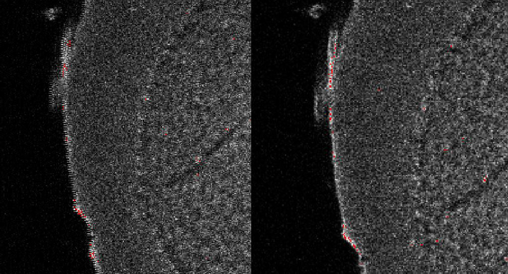

# Bidirectional Scanning Errors

## What is the bidirectional scanning artifact?
Two-photon microscopy is a point-scanning technique where a focused spot is [raster scanned](https://en.wikipedia.org/wiki/Raster_scan) over a region of tissue and emitted fluorescence collected over time using a [PMT](https://en.wikipedia.org/wiki/Photomultiplier_tube). 
Since the beam location is known with high precision, an image can be built up post-hoc. 
The microscope itself does not form an image in the traditional sense (i.e. there is no physical image on a camera). 

The raster scan has a fast scan axis, which typically is implemented with a resonant scanner that operates at a fixed frequency (often 8 kHz for our purposes) and a slow axis, which is controlled with a `galvo` (a mirror on a servo motor). 
To maximise frame rate, the acquisition software scans `bidirectionally`.
This means that it acquires image data as the fast scan axis moves left to right *and also* when it returns, moving right to left.
The resonant scan mirror returns a signal that indicates the moment at which it changes direction and based upon this clock, fluorescence intensity values are assigned to pixels in the image. 
However, there is a small phase shift between the reported moment at which the scan mirror changes direction and the actual time at which it does so. 
If this phase delay is not compensated for, the resulting image will exhibit a potentially significant and unpleasant jaggedness.  
i.e. Data from odd and even lines will be out of phase with respect to each other. 
if the bidirectional phase correction value is not set properly. An improper values will result in images that appear jagged. Below, the image on the right shows what things _should_ look like and the left image shows an example of bidirectional scanning artifact.




## Minimizing the bidirectional scanning artifact
The phase delay value for correcting for the artifact must be [checked manually in ScanImage](https://bakingtray.mouse.vision/users/user_guide/step_05_starting-the-acquisition) before the acquisition starts.

The phase delay between the outgoing and reverse scan directions is typically some small number of microseconds which translates to a small angular difference in scanner direction. 
Images acquired at coarser settings (fewer pixels per line) might mask a small phase delay mismatch. 
Higher resolution images (more pixels per line) might reveal small errors that are not visible at coarser settings. 
When imaging at higher resolutions, the phase delay value must be set carefully. 
Sub-pixel phase delay shifts are visible. 

The correct value to compensate for the phase delay **depends on the temperature of the resonant scanner**. 
This is why when the user starts a new sample in BakingTray the software immediately turns on the resonant scanner. 
In general the scanner will now have at least half an hour to warm up.
Consider warming up the scanner for 2 hours for acquisitions finer than 2 microns per pixel. 

## Was the bidi phase value set correctly in my acquisition?
Look at data from the first physical section. 
If you see bidirectional phase errors, then the bidi correction was not performed correctly during setup. 
If the bidirectional phase error gradually appears during the acquisition, then it was set correctly but subsequently drifted.


# Fixing the bidirectional phase delay post-hoc
It is possible to correct the bidirectional phase error if you have access to the unstitched raw data (the image tiles).
The procedure for correcting a single frame is easy to understand:

1. Use the odd lines to build up new image A and with the even lines build up new image B. 
2. Overlay A and B and a correlation-based approach to determine by how many image columns B should be translated such that its correlation with A is maximized. 
3. Shift B by this amount and rebuild the original image. 

If image SNR is sufficiently high, the above approach is robust and automated.
The shift value can be most efficiently calculated in frequency domain and sub-pixel shifts might be relevant as they are discernible under some imaging conditions. 
Luckily there is MATLAB code by [Manuel Guizar](https://uk.mathworks.com/matlabcentral/fileexchange/18401-efficient-subpixel-image-registration-by-cross-correlation?s_tid=prof_contriblnk) which addresses both of these issues. 
Manuel's code is commonly used in _in vivo_ functional imaging pipelines to correct for lateral motion of the sample. 
Here we use a slimmed down version of his code to correct for shifts associated with bidirectional scanning artifacts. 

Note that applying sub-pixel shifts to data can create artifacts if SNR is low. 
Sub-pixel is slower is also slower. 
The code presented here does not do sub-pixel corrections for these reasons. 


## Limits of the code presented here
The code provided here will correct bidirectional scanning artifacts post-hoc assuming you have access to the [raw tiles underlying your stitched images](https://stitchit.mouse.vision/new-users/the-experiment-directory-structure). 
The code works but is rarely used in practice so it is not well documented (sorry) and is not as automated as it could be. 
Before you proceed it is worth being familiar with [the basic steps involved in stitching samples with StitchIt](https://stitchit.mouse.vision/advanced-usage/stitching-existing-data).


## Getting shifts for a single section

```
>> stitchit.bidiCorrection.getShiftForSection(12,2)
```


### How this is applied
The `tileLoad` function has a param/value pair called `bidiShiftPixels`. 
This shifts loaded tiles by an integer amount. 
`tileLoad` is called by `stitchSection`, which also has a `bidiShiftPixels` that is simply passes to `tileLoad`. 
So to test the effect of a value you can just do something like:
```
stitchSection([170,1],1,'bidiShiftPixels',-1)
```

Then can stitch all four channels
```
for ii=1:4; stitchSection([],ii,'bidiShiftPixels',1,'OverWrite',false); end  
```

## Getting shifts for the whole acquisition
Often you find that the bidi value was set correctly then drifted over a few sections before settling to a stable value for the bulk of the acquisition. 
You can determine if this is happening using `stitchit.bidiCorrection.getShiftsForChannel`, which just runs `getShiftForSection` every `N` physical sections for a named channel. 
Choose the channel with the best SNR. 
The process is quite slow so initially you can run it every 10 or 20 sections and explore interesting time periods in more detail later. 
You have to stitch with the shift values manually yourself. 
